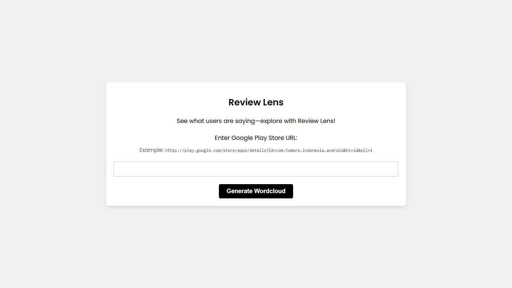
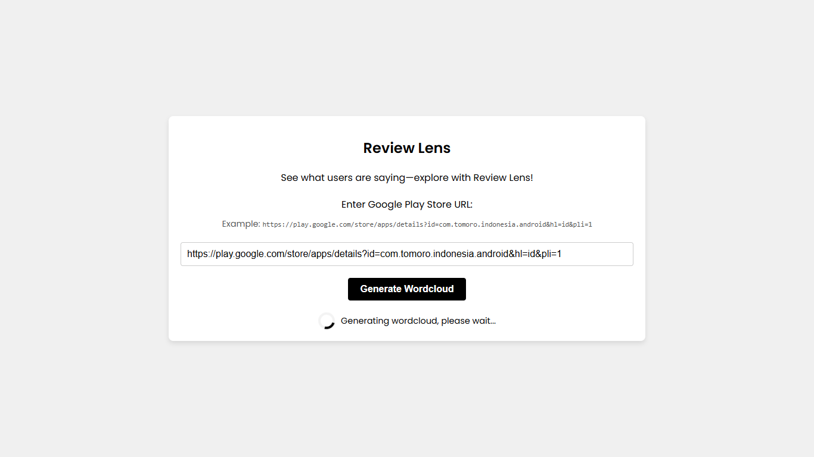
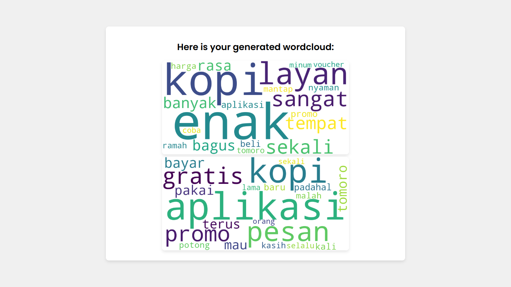

# Review Lens
Review Lens is a web application that leverages machine learning to generate insightful word clouds from Google Play Store reviews using Latent Dirichlet Allocation (LDA), a powerful topic modeling algorithm. The application also integrates Prometheus and Grafana for real-time monitoring and evaluation of the model's performance. Additionally, Docker is utilized for containerization, ensuring a smooth and consistent deployment process.


## Features
- **Word Cloud Generation**: Automatically generate word clouds from Google Play Store reviews.
- **Topic Modeling**: Utilize LDA to identify and visualize key topics from the reviews.
- **Monitoring and Evaluation**: Integrate Prometheus and Grafana to monitor model performance and application metrics.
- **Containerization**: Easily deploy the application using Docker.

## Technologies Used
- **Frontend**: HTML, CSS
- **Backend**: Flask
- **Machine Learning**: LDA (Latent Dirichlet Allocation)
- **Monitoring**: Prometheus, Grafana
- **Containerization**: Docker

## Installation
To get started with Review Lens, follow these steps:
1. **Clone the repository**:
   ```bash
   git clone https://github.com/nismafaaa/lda-wordcloud-app.git
   cd review-lens
   ```
2. **Install dependencies**:
   ```bash
   pip install -r requirements.txt
   ```
3. **Build and run the Docker containers**:
   ```bash
   docker-compose up --build
   ```
4. **Access the application**: Open your web browser and navigate to `http://localhost:8000`.
5. **Access Prometheus**: Open your web browser and navigate to `http://localhost:9090`.
6. **Access Grafana**: Open your web browser and navigate to `http://localhost:3000`. Use the default username `admin` and password `admin` to log in.

## Usage
1. **Enter Google Play Store URL**: In the web interface, input the URL of the Google Play Store application for which you want to analyze reviews.

2. **Generate Word Cloud**: The application will scrape the reviews, process the text, and generate a word cloud based on the identified topics.

3. **Monitor Performance**: Use the Grafana dashboard to monitor the application's performance and metrics.

## Monitoring with Prometheus and Grafana
To set up monitoring with Prometheus and Grafana:
1. Ensure Prometheus and Grafana are running in your environment. The `docker-compose.yml` file provided in the repository will handle this setup.
2. Configure Prometheus to scrape metrics from the Review Lens application. This is done by the `prometheus.yml` configuration file.
3. Import the Grafana dashboard to visualize the metrics.

### Adding Prometheus as a Data Source in Grafana
1. **Log in to Grafana**: Open your web browser and navigate to `http://localhost:3000`. Use the default username `admin` and password `admin` to log in.
2. **Add a new data source**:
   - Click on the gear icon (⚙️) in the left sidebar to go to the Configuration menu.
   - Click on "Data Sources".
   - Click on the "Add data source" button.
3. **Configure Prometheus**:
   - Select "Prometheus" from the list of available data sources.
   - In the "HTTP" section, set the URL to `http://localhost:9090`.
   - Click "Save & Test" to verify the connection.
4. **Create a new dashboard**:
   - Click on the "+" icon in the left sidebar and select "Dashboard".
   - Click on "Add new panel".
   - In the "Metrics" tab, select your Prometheus data source and enter a Prometheus query to visualize the metrics you are interested in.
   - Click "Apply" to save the panel.
Now you can see how the web application is performing using the available metrics.

For detailed setup instructions, refer to the official documentation for [Prometheus](https://prometheus.io/docs/introduction/overview/) and [Grafana](https://grafana.com/docs/grafana/latest/getting-started/getting-started/).

## Model Code
Here is an overview of the main components of the model code:
- **Scraping Reviews**: The `scrape_reviews` method scrapes reviews from a Google Play Store URL.
- **Preprocessing**: The `preprocess_reviews` method cleans and preprocesses the text data from the reviews.
- **LDA Model Generation**: The `generate_lda_model` method builds an LDA model to discover topics within the reviews.
- **Word Cloud Generation**: The `save_and_plot_word_cloud` method generates and saves word clouds for each topic.
- **Metrics**: Prometheus metrics are used to monitor various aspects of the application, such as scrape requests, errors, and durations.