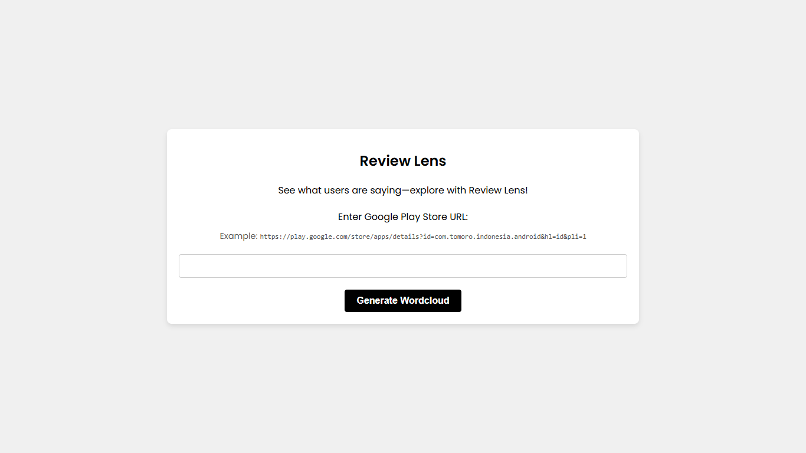
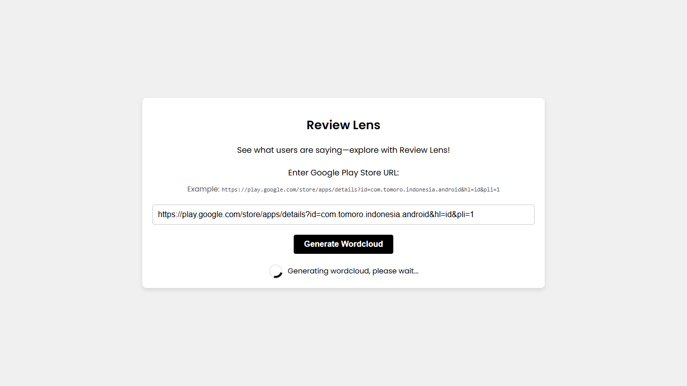
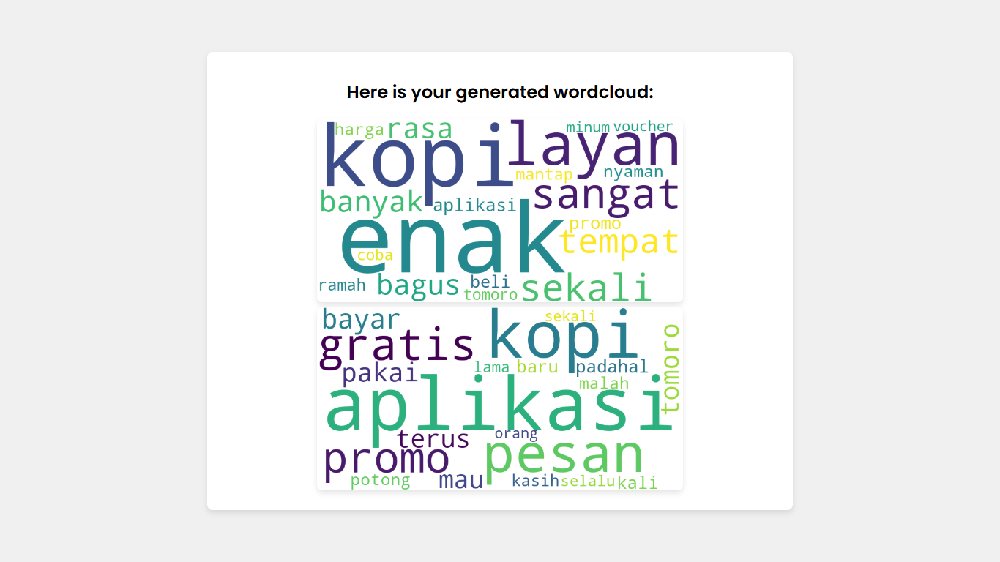
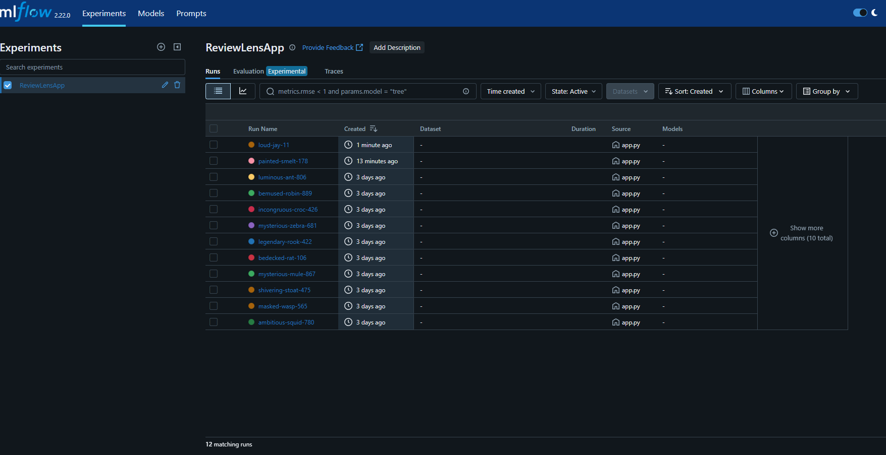
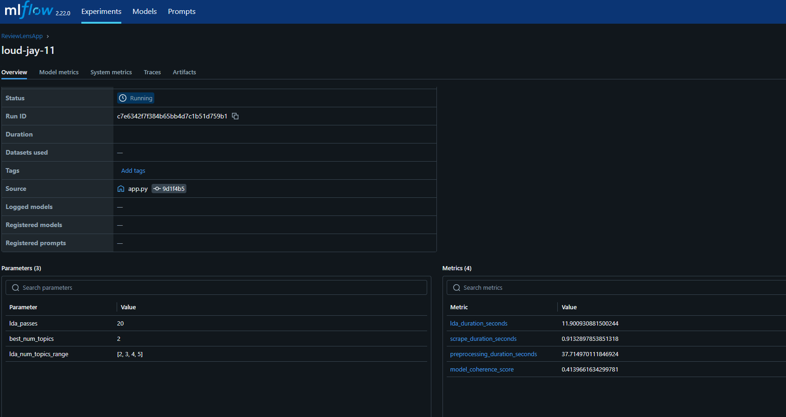

# Review Lens
Review Lens is a web application that leverages machine learning to generate insightful word clouds from Google Play Store reviews using Latent Dirichlet Allocation (LDA), a powerful topic modeling algorithm. The application integrates MLflow for experiment tracking and model management. Additionally, Docker is utilized for containerization, ensuring a smooth and consistent deployment process.


## Features
- **Word Cloud Generation**: Automatically generate word clouds from Google Play Store reviews.
- **Topic Modeling**: Utilize LDA to identify and visualize key topics from the reviews.
- **Experiment Tracking**: Track experiments and model performance using MLflow.
- **Containerization**: Easily deploy the application using Docker.

## Technologies Used
- **Frontend**: HTML, CSS
- **Backend**: Flask
- **Machine Learning**: LDA (Latent Dirichlet Allocation)
- **ML Experiment Tracking**: MLflow
- **Containerization**: Docker

## Installation
To get started with Review Lens, follow these steps:
1. **Clone the repository**:
   ```bash
   git clone https://github.com/nismafaaa/lda-wordcloud-app.git
   cd review-lens
   ```
2. **Install dependencies**:
   ```bash
   pip install -r requirements.txt
   ```
3. **Build and run the Docker containers**:
   ```bash
   docker-compose up --build
   ```
4. **Access the application**: Open your web browser and navigate to `http://localhost:8000`.
5. **Access MLflow UI**: Open your web browser and navigate to `http://localhost:5000`.

## Usage
1. **Enter Google Play Store URL**: In the web interface, input the URL of the Google Play Store application for which you want to analyze reviews.

2. **Generate Word Cloud**: The application will scrape the reviews, process the text, and generate a word cloud based on the identified topics.

3. **Track Experiments**: Use the MLflow UI to track experiments and model performance.

# Experiment Tracking with MLflow
MLflow is used to track experiments and manage models in Review Lens:


1. **Access MLflow UI**: Navigate to `http://localhost:5000` to access the MLflow tracking interface.
2. **View Experiments**: In the MLflow UI, you can:
   - View all experiment runs
   - Compare different model parameters
   - Track metrics and model performance
   - Access saved model artifacts
   - View topic distribution visualizations
3. **Tracked Metrics**:
   - **Time Metrics**:
     - Scraping duration (seconds)
     - Preprocessing duration (seconds)
     - LDA model generation duration (seconds)
     - Total process duration (seconds)
   - **Count Metrics**:
     - Number of reviews processed
     - Number of scraping requests
     - Error counts (if any occur)
4. **Tracked Parameters**:
   - Model type (LDA)
5. **Tags**:
   - Source URL (Google Play Store URL)
6. **Artifacts**:
   - Cleaned reviews dataset (CSV)

## Model Code
Here is an overview of the main components of the model code:

### Main Application Class (`ReviewLensApp`):
- Initializes MLflow tracking and experiment setup
- Manages the entire review analysis pipeline
- Handles error logging and experiment tracking

### Core Components:
1. **Scraping Module** (`scraping.py`):
   - Uses `google_play_scraper` to fetch reviews
   - Handles URL validation and error handling
   - Logs scraping metrics (duration, request count)

2. **Preprocessing Module** (`preprocessing.py`):
   - Text cleaning and normalization
   - Tokenization and stemming
   - Stopword removal
   - Handles abbreviation dictionary integration

3. **Modeling Module** (`modeling.py`):
   - Implements LDA (Latent Dirichlet Allocation) modeling
   - Generates topic distributions
   - Creates word clouds for visualizations

4. **MLflow Integration**:
   - Tracks experiment metrics:
     - Processing durations
     - Review counts
     - Error rates
   - Logs parameters and tags
   - Stores artifacts (cleaned reviews dataset)
   - Manages experiment runs and results

5. **Utility Functions** (`utils.py`):
   - Loads abbreviation dictionary
   - Provides helper functions for data processing

For detailed setup instructions, refer to the official documentation for [MLflow](https://mlflow.org/docs/latest/index.html).